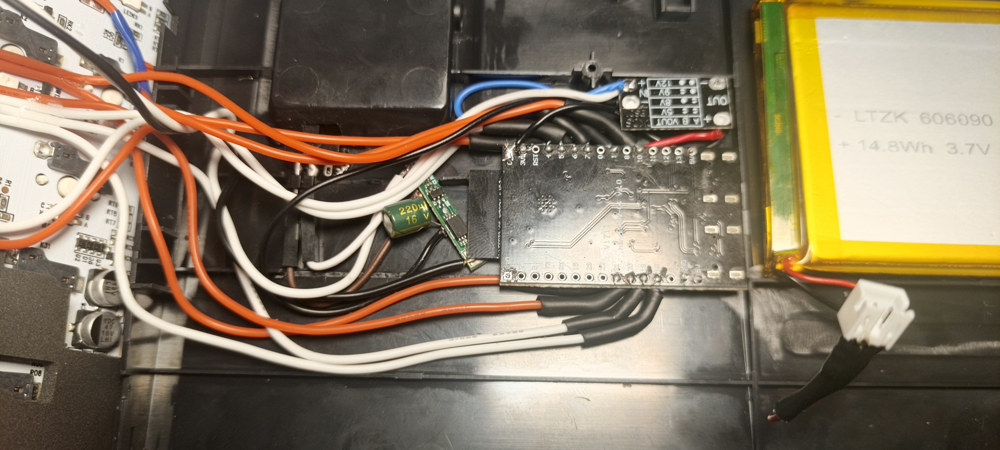
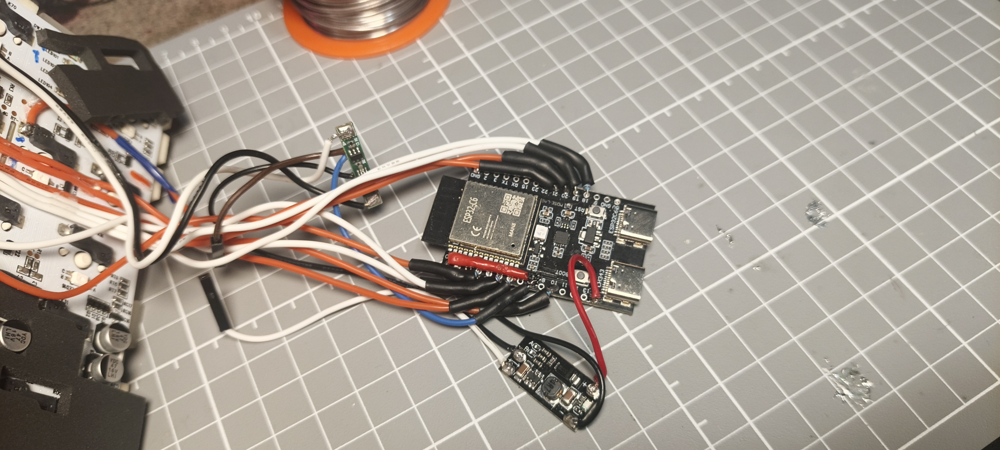
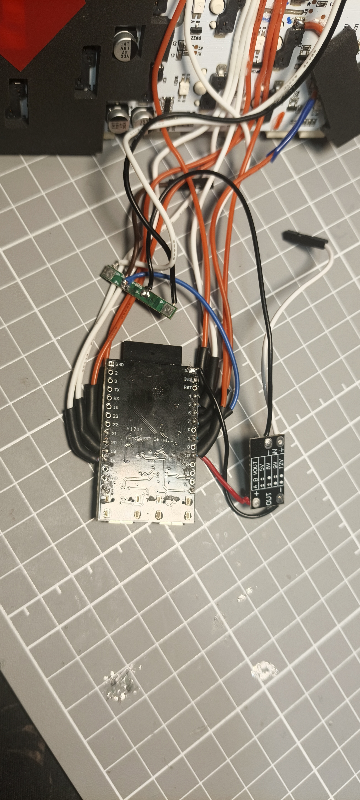

<div align="right">

🌐 **English** · [Русский](README.md)

</div>

<div align="center">

# ⌨️ AULA F75 → Zigbee buttons

### A regular keyboard that can control your smart home


</div>

---

## 👋 What is this

In this project I built a tiny **ESP32-C6** board (a microcontroller with a Zigbee radio)
inside a mechanical keyboard, the **AULA F75**.

Result: the keys **End + 1…6** became **12 wireless buttons** for your smart home.
Press a combo and an automation fires in Home Assistant: lights, a socket, a scene, anything.

Highlights:

- 🖥️ **No PC needed.** The board works on its own, even with the computer turned off.
- 🔌 **Works in every keyboard mode:** wired, 2.4G and Bluetooth.
- 🧠 **Doesn't break the keyboard.** The board only "listens" to key presses and sends nothing into the keyboard's circuit.
- 🔋 **Powered by the keyboard's own battery** (Li-Po, 4000 mAh).
- 📡 **Shows up in Zigbee2MQTT** as **VITAZGIO / AulaKeys**.
- 🔄 **Over-the-air updates (OTA)**: update the firmware without opening the keyboard.

> 💡 **Zigbee** is a low-power wireless protocol for smart homes.
> **Zigbee2MQTT** is software that connects such devices to Home Assistant without
> vendor hubs. **End Device** is a device that only sends its own data and does not
> relay other devices' traffic (saves battery).

---

## 🧰 What you need

| What | Why |
|---|---|
| AULA F75 keyboard (board `SI-2635-916-3632-V02`) | the keyboard itself |
| ESP32-C6 (I use nanoESP32-C6) | the brain and the Zigbee radio |
| Step-up module with a fixed 5/8/9/12 V output (set to 5 V) + 100 µF capacitor | 5 V for the ESP from the battery |
| 1S BMS (battery protection) | so the Li-Po is not over-discharged |
| Toggle switch | separate power switch for the ESP |
| Thin wires, 6 × 10 kΩ resistors | connecting to the key matrix |
| Zigbee coordinator + Zigbee2MQTT | receiving the buttons |

A soldering iron and a steady hand are mandatory 🙂

---

## 🔧 What it looks like inside

The keyboard PCB opened up. Thin wires run from the matrix points to the ESP32-C6.

<div align="center">

</div>

The ESP32-C6 installed in the case: the step-up module (top right), the BMS with the
capacitor (center) and the battery.

<div align="center">

</div>

The wiring before installing it in the case, top and bottom of the board.

<div align="center">

<br>

</div>

---

## 🧭 Contents

[How it works](#how-it-works) ·
[Key combos](#key-combos) ·
[Pinout](#pinout) ·
[Power](#-power) ·
[Flashing](#flashing-over-usb-first-time) ·
[Zigbee2MQTT](#connecting-to-zigbee2mqtt) ·
[Troubleshooting](#troubleshooting)

---

## How it works

Put simply: the keys in a keyboard are wired as a **matrix** (a grid of rows and columns).
The keyboard's own controller drives the rows one by one and checks which column the
signal shows up in. That's how it knows which key is pressed.

The ESP32 doesn't take part in this. It **eavesdrops**: it catches an interrupt
(an instant signal to the processor) on the falling edge of a scan line and, at that
moment, reads the state of the sense lines. If they match, the key is physically pressed.

That's why detection works in **all keyboard modes** (wired, 2.4G, BT) and doesn't depend
on what the keyboard's own firmware decided to send.

---

## Key combos

Everything depends on what you did with End **before** the working press. Digits
always react instantly, with no delay.

| What you did with End before | Then End + digit | Result |
|---|---|---|
| nothing | digit 1…6 | `Btn 1`…`Btn 6` |
| short tap (under 0.6 s) and release | digit 1…6 | `Btn 1 dbl`…`Btn 6 dbl` |
| held for 2 seconds and released | press End and **one** of digits **1, 2, 3** | Zigbee network reset |
| held for 2 seconds and released | press End and **one** of digits **4, 5, 6** | OTA mode (Wi-Fi, 3 minutes) |

**The flag is set the moment you release End** and lives for **3 seconds**, so you have
time to move your fingers. The flag is one-shot: used once, it's cleared.

If you pressed digits while holding End, that was normal work and the flag is not set,
whatever you do afterwards.

In service mode no buttons are sent to the network at all. Nothing needs to be held:
a **plain press of one digit** is enough (1, 2 or 3: reset; 4, 5 or 6: OTA).

---

## Pinout

| GPIO | What | Via |
|---|---|---|
| GPIO4 | End: sense line | 10k in series |
| GPIO5 | End: scan line | 10k in series |
| GPIO6 | Digit row: scan line (shared) | 10k in series |
| GPIO7 | Digit 1: sense line | 10k in series |
| GPIO10 | Digit 2: sense line | 10k in series |
| GPIO21 | Digit 3: sense line | 10k in series |
| GPIO20 | Digit 4: sense line | 10k in series |
| GPIO19 | Digit 5: sense line | 10k in series |
| GPIO18 | Digit 6: sense line | 10k in series |
| GPIO1 | Battery voltage measurement | 20k/20k divider |
| GND | `GND` pad of the ISP header near U1 | direct |

**Series resistor only, no resistor to ground.** A divider to ground loads the matrix
and the keyboard starts seeing stuck keys.

### Points on the keyboard PCB (SI-2635-916-3632-V02)

- **sense line**: the single (common, anode) leg of the dual diode `A3` next to the key
- **scan line**: the hot-swap socket contact that does NOT go to the diode
- **GND**: the `GND` pad of the `VDD TCK TDI TMS TDO GND` header near U1

The `A3` diodes are dual, with a common anode. One package serves two neighboring keys.
The `J3Y` parts are backlight transistors and have nothing to do with the matrix.

---

## ⚡ Power

The keyboard PCB has **no 3.3 V regulator**: the logic runs straight from the battery,
and the matrix lines sit at 4.2 V. Battery: LTZK 606090, Li-Po 3.7 V, 4000 mAh.

```
Battery (−) ──[1S BMS: B− in, P− out]──┐
Battery (+) ──────────────────────────┬┴── keyboard
                                      │
                            [switch]──┴──[step-up IN+/IN−]
                                           OUT+ ── 5V pin of the C6 board
                                           OUT− ── GND of the C6 board
                                           100 µF capacitor between 3V3 and GND
```

- **Step-up module**: a switching boost converter (it raises the voltage above the input,
  also with high efficiency). Its output is **fixed** at 5 / 8 / 9 / 12 V, selected with
  the `A` and `B` jumpers according to the table on the back of the board (a jumper is a
  pair of pads you bridge with a blob of solder). You need **5 V**: check the output with
  a multimeter before installing!
- The 5 V goes to the board's `5V` pin, and the built-in **AMS1117** regulator makes 3.3 V
  for the chip from it. It doesn't work straight from a Li-Po because it needs at least
  ~4.5 V at its input, so the battery voltage (3.0–4.2 V) is boosted to 5 V first.
- **What didn't work:** the linear regulator HT7333 (3.3 V straight into the `3V3` pin)
  and a module with a trimmer resistor (a little screw pot for setting the output by hand).
  The fixed-output step-up module got it running.
- **1S BMS** (DW01A + 8205A) is over-discharge protection, placed **in the negative wire**
  between the battery and the board. The keyboard itself only has the XT4097 charger.
- **100 µF capacitor** next to the board: Zigbee transmission draws pulses of up to 100 mA.
- **Its own switch**: the keyboard can't be physically turned off (its switch only changes
  the USB/2.4G/BT mode), so the ESP is powered down separately.

Turn the switch off when flashing over USB, otherwise 5 V from USB and 5 V from the
step-up module meet on the same pin. Don't feed anything into the `3V3` pin from outside:
5 V or 4.2 V from the battery will kill the chip.

### Battery measurement

```
Battery (+) after BMS ──[20k]──┬── GPIO1
                               │
                             [20k]
                               │
                              GND
```

The divider halves the voltage: 4.2 V → 2.1 V. If the percentage is off, adjust
`BAT_MIN_MV` / `BAT_MAX_MV` in the code.

---

## Antenna

The keyboard's top plate is metal. Place the board against the plastic bottom, antenna
toward the edge of the case, away from the plate, the battery and the keyboard's own
`ANT2` antenna (the meander trace in the bottom right corner of the PCB).

---

## Flashing over USB (first time)

The board has two USB-C ports. Flash through the **CH343** port (a regular USB-UART bridge),
not the native `ESP32C6` one.

Before the first build:

```
src/secrets.example.h  →  src/secrets.h     (Wi-Fi and OTA password)
secrets.example.ini    →  secrets.ini       (board IP for over-the-air upload)
```

Both files are in `.gitignore` and never reach the repository.

```
pio run -e esp32-c6
pio run -e esp32-c6 -t upload
```

In VS Code: PlatformIO icon on the left → Project Tasks → **esp32-c6** → Upload.

If you get `qio_mode: Failed to set QIE bit` and an endless reboot: `platformio.ini`
already has `board_build.flash_mode = dio`, but after editing it you need a **Clean**.

### Erase flash (changing the Zigbee network)

```
& "$env:USERPROFILE\.platformio\penv\Scripts\python.exe" `
  "$env:USERPROFILE\.platformio\packages\tool-esptoolpy\esptool.py" `
  --chip esp32c6 --port COM6 erase_flash
```

---

## Flashing over the air (no need to open the keyboard)

1. On the keyboard: **hold End for 2 seconds → release → press End and any one of digits 4, 5, 6**
2. The ESP reboots, brings up Wi-Fi and waits for the firmware for **3 minutes**
3. Find its IP in your router (host `aulakeys`) or via `ping aulakeys.local`
4. Put the IP into `secrets.ini`
5. Upload:

```
pio run -e esp32-c6-ota -t upload
```

In VS Code: Project Tasks → **esp32-c6-ota** → Upload.

The OTA password is set in `secrets.h` (`OTA_PASSWORD`).

If you didn't make it in 3 minutes or Wi-Fi didn't come up, the ESP returns to Zigbee mode
on its own, and you can repeat the combo.

The flash layout `ota.csv` holds **two app partitions** (`ota_0` / `ota_1`); without this,
over-the-air flashing is impossible.

---

## Connecting to Zigbee2MQTT

1. Copy `zigbee2mqtt/aulakeys.js` into the z2m folder, next to `configuration.yaml`
2. In `configuration.yaml`:

```yaml
external_converters:
  - aulakeys.js
```

3. Restart z2m
4. Enable Permit Join in z2m
5. After `erase_flash` the board joins by itself → **VITAZGIO / AulaKeys**

### Entities

| Entity | Combo |
|---|---|
| `Btn 1`…`Btn 6` | End + digit |
| `Btn 1 dbl`…`Btn 6 dbl` | tap End, then End + digit |
| `battery` | charge percentage, heartbeat every 5 min |
| `linkquality` | measured by the coordinator, z2m shows it itself |

Each button is a pulse: `ON` for 300 ms, then `OFF`. In HA, attach the automation to the
transition to `ON`.

The endpoints are built on the `msOccupancySensing` cluster (occupancy sensor), the
simplest binary cluster, available in every version of arduino-esp32.

### Link check

The device doesn't know its own `linkquality`; the coordinator calculates it. So every
5 minutes a heartbeat is sent: `battery`, `linkquality` and `last_seen` update even if
no buttons were touched. The link state is printed to Serial.

---

## PC silencer (AutoHotkey v2)

So that End and the combos do nothing in Windows. Put it in startup
(`Win+R` → `shell:startup`):

```
#Requires AutoHotkey v2.0

End::return
End & 1::return
End & 2::return
End & 3::return
End & 4::return
End & 5::return
End & 6::return
```

Single digits keep typing as usual. With the PC off the script isn't needed: the ESP
works on its own.

---

## Settings in the code

| Constant | Meaning |
|---|---|
| `TAP_MAX_MS` | End shorter than this = request for the second row (600) |
| `SERVICE_HOLD_MS` | End longer than this = request for settings (2000) |
| `ALT_WINDOW_MS` | how long the second-row flag lives (3000) |
| `SERVICE_WINDOW_MS` | how long the settings flag lives (3000) |
| `CHORD_MIN_KEYS` | how many digits of a group are enough for a service command (1) |
| `DEBOUNCE_CYCLES` | confirmations for digits (2 × 30 ms) |
| `END_DEBOUNCE` | confirmations for End (1, otherwise a fast tap is lost) |
| `PULSE_MS` | button pulse length (300 ms) |
| `HEARTBEAT_MS` | network report period (5 min) |
| `OTA_TIMEOUT_MS` | how long to wait for firmware in OTA mode (3 min) |
| `USE_LIGHT_SLEEP` | sleep between key presses: enable after debugging |

If the tap works only every other time, raise `TAP_MAX_MS`. If the second row turns on
by accident during fast typing, lower `ALT_WINDOW_MS`.

Serial shows which mode was detected: `[MODE] тап -> жду второй ряд`,
`[MODE] удержание -> жду настройки`, `[MODE] второй ряд`, `[MODE] НАСТРОЙКИ`
(log messages are in Russian: tap → waiting for second row, hold → waiting for settings,
second row, SETTINGS). These lines make it easy to check that your hands land in the right mode.

---

## Power consumption

| Mode | Current | 4000 mAh lasts |
|---|---|---|
| `USE_LIGHT_SLEEP 0`, always awake | ~30 mA | ~5 days |
| `USE_LIGHT_SLEEP 1`, sleep between key presses | a few mA on average | weeks |

The keyboard scans the matrix **only when something is pressed**; at rest the lines are
silent. That's why sleep works: the ESP wakes on a low level on a scan line.

---

## Troubleshooting

| Symptom | Cause / fix |
|---|---|
| All buttons fire at once | wrong edge is read. Interrupt is `FALLING`, active level is LOW |
| Second row fires like the first | a fast tap doesn't register in time. You need `POLL_MS 30` and `END_DEBOUNCE 1` |
| Keyboard "holds" a row by itself | a resistor to ground is on the line → remove it, keep only the series one |
| Silence in the monitor when pressing | you hit a backlight line, not the matrix |
| Multimeter shows 25–30 kΩ between lines | those are the ESP's own protection diodes, not a link on the PCB. Measure only with the ESP disconnected |
| Keyboard goes crazy when the ESP is unpowered | phantom power through the ESD diodes. Order: GND → ESP power → signals |
| Button stuck at `ON` in z2m | the `OFF` packet was lost. The firmware sends repeats and clears stuck ones every 30 s |
| `qio_mode: Failed to set QIE bit`, reboot loop | `board_build.flash_mode = dio` + Clean |
| Doesn't appear in z2m | flash not erased → `erase_flash`, then Permit Join |
| Buttons show `N/A` in z2m | binding in the converter's `configure` failed, check the z2m log |
| `ZigbeeBinary does not name a type` | old arduino-esp32 version. The code uses `ZigbeeOccupancySensor`, which exists everywhere |
| `Pin is not configured as analog channel` | an idle `analogRead` is needed before `analogSetPinAttenuation` |

---

## Project files

```
ESP32-c6_AULA_KEYBOARD/
├── platformio.ini            build config, two environments
├── ota.csv                   flash layout with two OTA partitions
├── secrets.example.ini       template → secrets.ini (IP for OTA)
├── .gitignore
├── README.md                 documentation (Russian)
├── README.en.md              documentation (English)
├── src/
│   ├── main.cpp              firmware
│   └── secrets.example.h     template → secrets.h (Wi-Fi, OTA password)
└── zigbee2mqtt/
    └── aulakeys.js           external converter for z2m
```

Not committed to git: `src/secrets.h`, `secrets.ini`, `.pio/`, binaries.

---

**Project:** AULA F75 Zigbee Keys · Zigbee End Device · VITAZGIO
