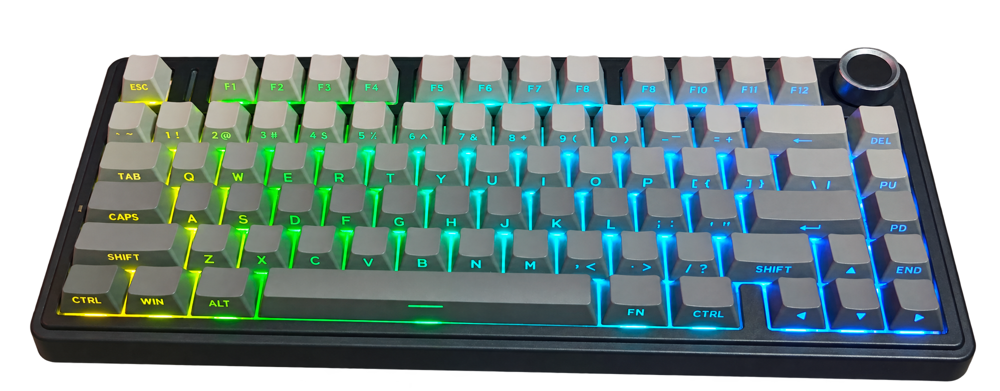
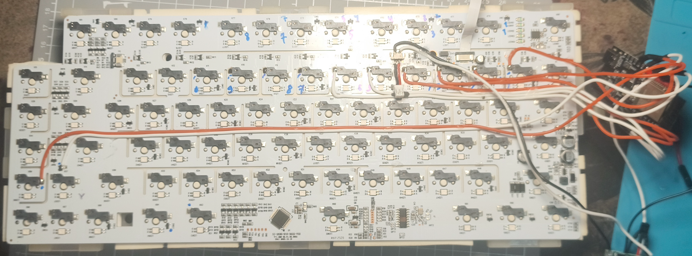

<div align="center">

# ⌨️ AULA F75 → Zigbee-кнопки

**ESP32-C6 внутри клавиатуры превращает End + цифры в 12 беспроводных кнопок для умного дома**




</div>

---

## 📌 О проекте

ESP32-C6 сидит внутри клавиатуры, пассивно слушает матрицу клавиш и отдаёт
в Zigbee2MQTT **12 кнопок**. Работает независимо от ПК — хоть выключен, хоть нет.

- 🔌 Работает в любом режиме клавиатуры: провод, 2.4G, Bluetooth
- 🔋 Питание от штатного аккумулятора клавиатуры (Li-Po 4000 мА·ч)
- 📡 Устройство в z2m: **VITAZGIO / AulaKeys**, тип — **Zigbee End Device**
  (оконечное устройство, не ретранслирует чужой трафик, в отличие от роутера)
- 🔄 Обновление прошивки по воздуху (OTA — Over-The-Air, без USB-кабеля)

### 🔧 Как выглядит внутри

Плата клавиатуры в разборе: тонкие провода идут от точек матрицы к ESP32-C6.

<div align="center">

</div>

---

## Как это работает

Клавиши в клавиатуре собраны в матрицу: контроллер по очереди дёргает сканирующие
линии, а линии чтения в этот момент опрашивает. ESP32 не вмешивается — он
подслушивает: ловит прерывание по спаду сканирующей линии и прямо в этот момент
читает состояние линий чтения. Совпало — клавиша физически нажата.

Поэтому детекция работает **во всех режимах** клавиатуры (провод, 2.4G, BT)
и не зависит от того, что решила отправить её родная прошивка.

---

## Сочетания клавиш

Всё решает то, что было с End **до** рабочего зажатия. Цифры везде срабатывают
мгновенно, без задержек.

| Что сделал с End до | Потом зажал End + цифра | Результат |
|---|---|---|
| ничего | цифра 1…6 | `Btn 1`…`Btn 6` |
| тапнул коротко (меньше 0.6 с) и отпустил | цифра 1…6 | `Btn 1 dbl`…`Btn 6 dbl` |
| подержал 2 секунды и отпустил | 2 из цифр **1, 2, 3** | сброс сети Zigbee |
| подержал 2 секунды и отпустил | 2 из цифр **4, 5, 6** | режим OTA (Wi-Fi, 3 минуты) |

**Флаг взводится в момент отпускания End** и живёт **3 секунды** — успеваешь
спокойно переложить пальцы. Флаг одноразовый: использовал — сбросился.

Если во время удержания End ты нажимал цифры, это была обычная работа —
флаг не взводится, что бы ты потом ни делал.

В сервисном режиме кнопки в сеть не шлются вообще. Хватает **любых 2 цифр из 3**
— если провод отвалится, аккорд всё равно соберётся.

---

## Распиновка

| GPIO | Что | Через |
|---|---|---|
| GPIO4 | End — линия чтения | 10к послед. |
| GPIO5 | End — сканирующая линия | 10к послед. |
| GPIO6 | Цифровой ряд — сканирующая (общая) | 10к послед. |
| GPIO7 | Цифра 1 — линия чтения | 10к послед. |
| GPIO10 | Цифра 2 — линия чтения | 10к послед. |
| GPIO21 | Цифра 3 — линия чтения | 10к послед. |
| GPIO20 | Цифра 4 — линия чтения | 10к послед. |
| GPIO19 | Цифра 5 — линия чтения | 10к послед. |
| GPIO18 | Цифра 6 — линия чтения | 10к послед. |
| GPIO1 | Замер напряжения аккумулятора | делитель 20к/20к |
| GND | пятак `GND` из ISP-шестёрки у U1 | напрямую |

**Только последовательный резистор, без резистора на землю.** Делитель на землю
подгружает матрицу — клавиатура начинает видеть залипшие клавиши.

### Точки на плате клавиатуры (SI-2635-916-3632-V02)

- **линия чтения** — одиночная (общая, анодная) нога сдвоенного диода `A3` рядом с клавишей
- **сканирующая линия** — контакт хотсвап-гнезда, который НЕ идёт на диод
- **GND** — пятак `GND` из шестёрки `VDD TCK TDI TMS TDO GND` возле U1

Диоды `A3` — сдвоенные, с общим анодом. Один корпус обслуживает две соседние
клавиши. Компоненты `J3Y` — транзисторы подсветки, к матрице отношения не имеют.

---

## ⚡ Питание

На плате клавиатуры **нет стабилизатора 3.3 В** — логика питается прямо от
аккумулятора, на линиях матрицы 4.2 В. Аккумулятор LTZK 606090, Li-Po 3.7 В, 4000 мА·ч.

```
Аккум (−) ──[BMS 1S: B− вход, P− выход]──┐
Аккум (+) ──────────────────────────────┬┴── клавиатура
                                        │
                              [тумблер]─┴──[HT7333]── пин 3V3 платы C6
                                             конденсатор 100 мкФ между 3V3 и GND
```

- **HT7333** (TO-92) — LDO с малым падением, работает от 3.4 В. Обязателен:
  встроенный на плате **AMS1117 требует минимум ~4.5 В** и от Li-Po работать не будет.
  Пин `5V` платы не используется вообще.
- **BMS 1S** (DW01A + 8205A) — защита от переразряда, ставится **в разрыв минусового
  провода** между аккумулятором и платой. На клавиатуре стоит только зарядник XT4097.
- **Конденсатор 100 мкФ** рядом с платой — Zigbee-передача даёт импульсы под 100 мА.
- **Свой тумблер** — клавиатура физически не выключается (переключатель только
  меняет режим USB/2.4G/BT), так что ESP гасится отдельно.

При прошивке по USB тумблер выключить. В пин `3V3` подавать только выход HT7333 —
4.2 В убьют чип.

### Замер батареи

```
Аккум (+) после BMS ──[20к]──┬── GPIO1
                             │
                           [20к]
                             │
                            GND
```

Делитель пополам: 4.2 В → 2.1 В. Если процент врёт — подстрой `BAT_MIN_MV` /
`BAT_MAX_MV` в коде.

---

## Антенна

Верхняя плита клавиатуры металлическая. Плату класть к пластиковому низу,
антенной к краю корпуса, подальше от плиты, от аккумулятора и от антенны
`ANT2` самой клавиатуры (меандр в правом нижнем углу платы).

---

## Прошивка по USB (первый раз)

Плата с двумя USB-C. Прошивать через разъём **CH343** (обычный USB-UART мост),
не через нативный `ESP32C6`.

Перед первой сборкой:

```
src/secrets.example.h  →  src/secrets.h     (Wi-Fi и пароль OTA)
secrets.example.ini    →  secrets.ini       (IP платы для заливки по воздуху)
```

Оба файла в `.gitignore`, в репозиторий не попадают.

```
pio run -e esp32-c6
pio run -e esp32-c6 -t upload
```

В VS Code: иконка PlatformIO слева → Project Tasks → **esp32-c6** → Upload.

Если сыпется `qio_mode: Failed to set QIE bit` и вечный ребут — в `platformio.ini`
уже стоит `board_build.flash_mode = dio`, но после правки нужен **Clean**.

### Стереть флеш (смена сети Zigbee)

```
& "$env:USERPROFILE\.platformio\penv\Scripts\python.exe" `
  "$env:USERPROFILE\.platformio\packages\tool-esptoolpy\esptool.py" `
  --chip esp32c6 --port COM6 erase_flash
```

---

## Прошивка по воздуху (клавиатуру разбирать не нужно)

1. На клавиатуре: **подержать End 2 секунды → отпустить → зажать End + любые 2 из цифр 4, 5, 6**
2. ESP перезагружается, поднимает Wi-Fi, ждёт прошивку **3 минуты**
3. Найти его IP в роутере (хост `aulakeys`) или по `ping aulakeys.local`
4. Вписать IP в `secrets.ini`
5. Залить:

```
pio run -e esp32-c6-ota -t upload
```

В VS Code: Project Tasks → **esp32-c6-ota** → Upload.

Пароль OTA задаётся в `secrets.h` (`OTA_PASSWORD`).

Не успел за 3 минуты или Wi-Fi не поднялся — ESP сам вернётся в Zigbee-режим,
аккорд можно повторить.

Разметка флеша `ota.csv` держит **два раздела под программу** (`ota_0` / `ota_1`) —
без этого прошивка по воздуху невозможна в принципе.

---

## Подключение к Zigbee2MQTT

1. `zigbee2mqtt/aulakeys.js` → в папку z2m, рядом с `configuration.yaml`
2. В `configuration.yaml`:

```yaml
external_converters:
  - aulakeys.js
```

3. Перезапустить z2m
4. Permit Join в z2m
5. Плата после `erase_flash` сама сделает join → **VITAZGIO / AulaKeys**

### Сущности

| Сущность | Комбинация |
|---|---|
| `Btn 1`…`Btn 6` | зажал End + цифра |
| `Btn 1 dbl`…`Btn 6 dbl` | тап End, затем зажал End + цифра |
| `battery` | процент заряда, heartbeat раз в 5 мин |
| `linkquality` | считает координатор, z2m показывает сам |

Каждая кнопка — импульс: `ON` на 300 мс, потом `OFF`. В HA вешаешь автоматизацию
на переход в `ON`.

Эндпоинты сделаны на кластере `msOccupancySensing` (датчик присутствия) — самый
простой бинарный кластер, есть во всех версиях arduino-esp32.

### Проверка связи

Устройство не знает свой `linkquality` — его считает координатор. Поэтому раз
в 5 минут уходит heartbeat: обновляются `battery`, `linkquality` и `last_seen`,
даже если кнопки не трогали. Состояние связи пишется в Serial.

---

## Глушилка на ПК (AutoHotkey v2)

Чтобы End и комбинации ничего не делали в Windows. В автозагрузку
(`Win+R` → `shell:startup`):

```
#Requires AutoHotkey v2.0

End::return
End & 1::return
End & 2::return
End & 3::return
End & 4::return
End & 5::return
End & 6::return
```

Одиночные цифры продолжают печататься как обычно. Когда ПК выключен — скрипт
не нужен, ESP работает сам по себе.

---

## Настройки в коде

| Константа | Смысл |
|---|---|
| `TAP_MAX_MS` | короче этого End = заявка на второй ряд (600) |
| `SERVICE_HOLD_MS` | дольше этого End = заявка на настройки (2000) |
| `ALT_WINDOW_MS` | сколько живёт флаг второго ряда (3000) |
| `SERVICE_WINDOW_MS` | сколько живёт флаг настроек (3000) |
| `CHORD_MIN_KEYS` | сколько цифр из группы хватает для аккорда (2) |
| `DEBOUNCE_CYCLES` | подтверждений для цифр (2 × 30 мс) |
| `END_DEBOUNCE` | подтверждений для End (1 — иначе теряется быстрый тап) |
| `PULSE_MS` | длительность импульса кнопки (300 мс) |
| `HEARTBEAT_MS` | период отчёта в сеть (5 мин) |
| `OTA_TIMEOUT_MS` | сколько ждать прошивку в режиме OTA (3 мин) |
| `USE_LIGHT_SLEEP` | сон между нажатиями — включать после отладки |

Если тап срабатывает через раз — подними `TAP_MAX_MS`. Если второй ряд включается
случайно при быстрой работе — опусти `ALT_WINDOW_MS`.

В Serial видно, какой режим определился: `[MODE] тап -> жду второй ряд`,
`[MODE] удержание -> жду настройки`, `[MODE] второй ряд`, `[MODE] НАСТРОЙКИ`.
По этим строкам удобно проверять, что руки попадают в нужный режим.

---

## Энергопотребление

| Режим | Ток | 4000 мА·ч хватит на |
|---|---|---|
| `USE_LIGHT_SLEEP 0`, всегда бодр | ~30 мА | ~5 дней |
| `USE_LIGHT_SLEEP 1`, сон между нажатиями | единицы мА в среднем | недели |

Клавиатура сканирует матрицу **только когда что-то нажато** — в покое на линиях
тишина. Поэтому сон работает: ESP просыпается по низкому уровню на сканирующей линии.

---

## Диагностика

| Симптом | Причина / лечение |
|---|---|
| Срабатывают все кнопки разом | читается не тот фронт. Прерывание `FALLING`, активный уровень LOW |
| Второй ряд срабатывает как первый | быстрый тап не успевает зарегистрироваться. Нужны `POLL_MS 30` и `END_DEBOUNCE 1` |
| Клавиатура сама «зажимает» ряд | на линии висит резистор на землю → убрать, оставить только последовательный |
| В мониторе тишина при нажатии | попал на линию подсветки, а не матрицы |
| Мультиметр показывает 25–30 кОм между линиями | это защитные диоды самого ESP, не связь на плате. Мерить только при отключённом ESP |
| Клава сходит с ума, когда ESP обесточен | фантомное запитывание через ESD-диоды. Порядок: GND → питание ESP → сигналы |
| Кнопка залипла в `ON` в z2m | потерян пакет `OFF`. Прошивка шлёт повторы и убирает залипшие раз в 30 с |
| `qio_mode: Failed to set QIE bit`, ребут-луп | `board_build.flash_mode = dio` + Clean |
| В z2m не появляется | не стёрт флеш → `erase_flash`, потом Permit Join |
| Кнопки `N/A` в z2m | не отработала привязка в `configure` конвертера, смотри лог z2m |
| `ZigbeeBinary does not name a type` | старая версия arduino-esp32. Код на `ZigbeeOccupancySensor`, он есть везде |
| `Pin is not configured as analog channel` | перед `analogSetPinAttenuation` нужен холостой `analogRead` |

---

## Файлы проекта

```
ESP32-c6_AULA_KEYBOARD/
├── platformio.ini            конфиг сборки, два окружения
├── ota.csv                   разметка флеша с двумя разделами под OTA
├── secrets.example.ini       шаблон → secrets.ini (IP для OTA)
├── .gitignore
├── README.md
├── src/
│   ├── main.cpp              прошивка
│   └── secrets.example.h     шаблон → secrets.h (Wi-Fi, пароль OTA)
└── zigbee2mqtt/
    └── aulakeys.js           внешний конвертер для z2m
```

Не попадают в git: `src/secrets.h`, `secrets.ini`, `.pio/`, бинарники.

---

**Проект:** AULA F75 Zigbee Keys · Zigbee End Device · VITAZGIO
